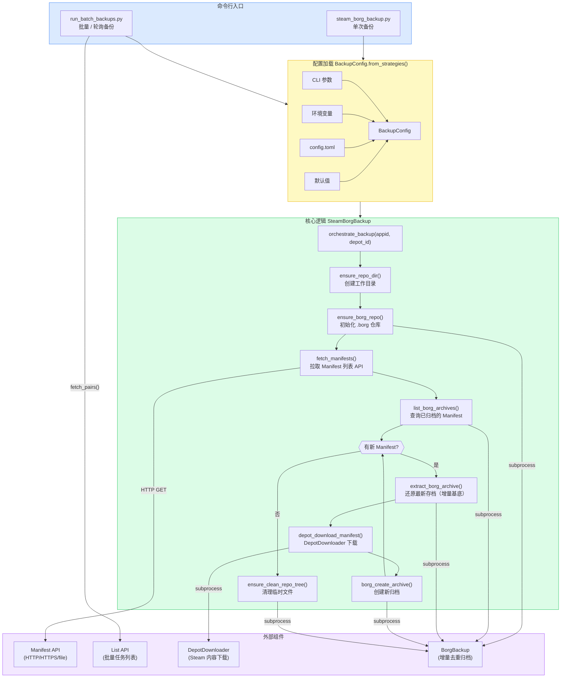

# Steam Borg Backup

自动将 Steam Depot 历史版本下载并归档至 [BorgBackup](https://www.borgbackup.org/) 仓库，支持单次备份与批量轮询两种模式。

## 依赖

| 工具 | 说明 |
|---|---|
| Python 3.11+ | `tomllib` 为内置模块（3.11 以下需安装 `tomli`） |
| [DepotDownloader](https://github.com/SteamRE/DepotDownloader) | 从 Steam 下载指定 Manifest |
| [BorgBackup](https://www.borgbackup.org/) | 增量去重归档 |
| Manifest API | 自托管接口，返回指定 appid/depot 的 manifest 列表 |

## 快速开始

```bash
# 1. 复制并填写配置文件
cp config.example.toml config.toml

# 2. 单次备份一个 Depot
python steam_borg_backup.py --appid 440 --depot 441

# 3. 批量备份（从接口拉取列表，单次运行）
python run_batch_backups.py --list-api https://your-host/webhook/steam_appid_depot_id

# 4. 批量备份（持续轮询，每 60 秒一轮）
python run_batch_backups.py --list-api https://your-host/webhook/steam_appid_depot_id --interval 60
```

## 配置优先级

配置来源按以下优先级叠加（高优先级覆盖低优先级）：

```
CLI 参数 > 环境变量 > config.toml > 默认值
```

### config.toml 主要字段

| 字段 | 默认值 | 说明 |
|---|---|---|
| `work_dir` | `/mnt/z/depots/data` | 备份根目录 |
| `manifest_api_url` | — | Manifest 列表接口 URL |
| `list_api_url` | — | 批量任务列表接口 URL |
| `depot_downloader_cmd` | `DepotDownloader` | 可执行文件路径或命令名 |
| `borg_cmd` | `borg` | 可执行文件路径或命令名 |
| `steam_username` | — | Steam 用户名 |
| `steam_password` | — | Steam 密码（可选） |
| `api_timeout` | `15` | 接口超时秒数 |
| `api_retries` | `3` | 超时重试次数 |
| `retry_backoff_sec` | `2.0` | 指数退避基础间隔（秒） |
| `verify_ssl` | `true` | 是否验证 SSL 证书 |
| `dry_run` | `false` | 仅打印命令，不执行 |
| `loop_interval_sec` | `0` | 批量轮询间隔（0 = 单次） |

等价环境变量：`WORK_DIR`、`MANIFEST_API_URL`、`LIST_API_URL`、`STEAM_USERNAME`、`STEAM_PASSWORD`、`DRY_RUN`、`LOOP_INTERVAL` 等。

## 工作目录结构

```
work_dir/
└── {appid}_{depot_id}/          # 每个 Depot 独立目录
    ├── .borg/                   # Borg 仓库（无加密）
    │   ├── config
    │   └── data/
    └── （临时文件，备份完成后自动清理）
```

每个 Manifest 以其 `manifest_id` 作为 Borg 归档名，时间戳取自 API 返回的 `seen_date`。

## 架构图



## Borg 仓库说明

### 压缩

Borg 默认使用 **lz4** 压缩（高速、低 CPU 占用）。本项目使用 `--encryption=none` 初始化仓库，不加密，适合本地受控存储场景。

如需更高压缩率，可在 `borg create` 时手动加 `--compression zstd`，但需修改 `borg_create_archive()` 传参。

### 去重机制

Borg 以内容定义的**可变长分块（CDC）**进行去重：不同 Manifest 之间相同的文件块只存储一次，多个版本共享数据块，空间利用率远高于全量备份。

### 归档命名规则

每个归档以 `manifest_id` 命名，时间戳取自 API 的 `seen_date`：

```
.borg::1234567890123456789   ←  manifest_id
          timestamp = seen_date（UTC）
```

> 修改归档命名规则会导致已有归档无法被识别为"已备份"，触发重复下载。

### 仓库迁移

若 `work_dir` 路径发生变更（如本项目从 `/mnt/z/depots/` 迁移至 `/mnt/z/depots/data/`），Borg 首次访问时会弹出路径变更确认。运行时通过环境变量自动处理：

```
BORG_RELOCATED_REPO_ACCESS_POLICY=allow
```

### 崩溃恢复

若备份中途中断（Ctrl+C、系统崩溃），Borg 可能遗留锁文件，下次运行会超时报错。手动解锁：

```bash
cd /mnt/z/depots/data/{appid}_{depot_id}
borg break-lock .borg
```

---

## 文件说明

| 文件 | 说明 |
|---|---|
| [borg_backup_lib.py](borg_backup_lib.py) | 核心库：`BackupConfig`、`SteamBorgBackup`、工具函数 |
| [steam_borg_backup.py](steam_borg_backup.py) | 单次备份 CLI 入口 |
| [run_batch_backups.py](run_batch_backups.py) | 批量 / 轮询备份 CLI 入口 |
| [config.example.toml](config.example.toml) | 配置文件模板 |

## Manifest API 接口格式

**manifest_api_url** 需返回如下 JSON：

```json
{
  "data": [
    {
      "manifest_id": "1234567890123456789",
      "depot_id": "441",
      "appid": "440",
      "seen_date": "2024-01-15T10:30:00Z"
    }
  ]
}
```

**list_api_url**（批量模式）需返回：

```json
[
  { "appid": "440", "depot_id": "441" },
  { "appid": "730", "depot_id": "731" }
]
```

也支持 `{ "data": [...] }` 或 `{ "pairs": [...] }` 的包裹格式，字段名兼容 `app_id` / `app`、`depot` 等变体。
